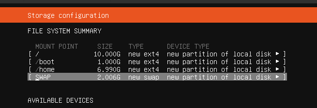
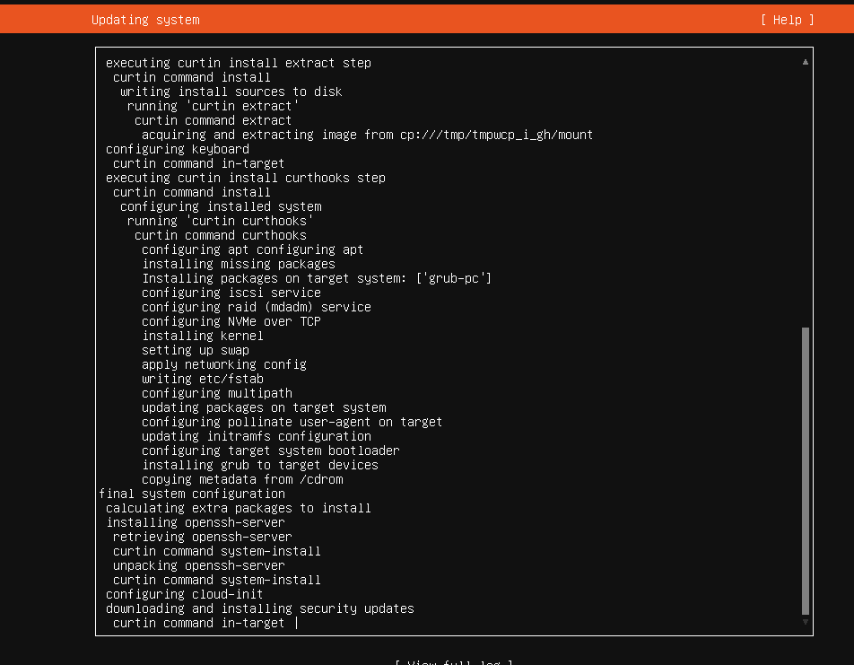
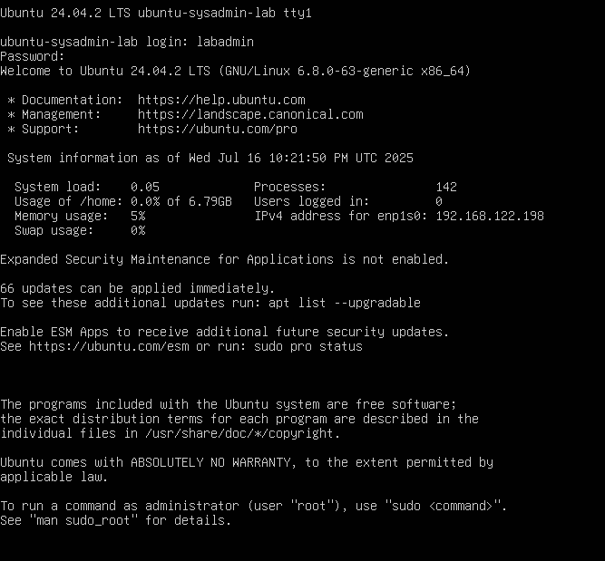

# Installation

This section outlines the entire process of installing Ubuntu Server LTS in a QEMU virtual machine. The installation was done manually to show understanding of system provisioning, partitioning, and basic setup tasks.

## Installation Medium

- **ISO Used:** Ubuntu Server 22.04 LTS (64-bit)
- **VM Platform:** QEMU via Virt-Manager on Pop!_OS

## VM Settings

- **CPU:** 2 cores
- **RAM:** 4096 MB
- **Storage:** 32 GB (QCOW2)
- **Networking:** User-mode NAT (default QEMU)

## Installation Steps

1. **Language, Region, and Keyboard Selection** 
   Follow default prompts or select your preferred language and keyboard layout.

2. **Installation Type** 
   Choose: 
   `Ubuntu Server` (not the minimized version) 
   Skip third-party drivers unless needed.

3. **Network Configuration** 
   - Confirm `enp1s0` or equivalent interface is assigned a valid DHCP IP.
   - Leave proxy settings blank unless required.
   - Accept default mirror list.

4. **Partitioning** 
   Manual layout:
   - `/dev/vda1` – 1.0 GB ext4 `/boot` (bootable)
   - `/dev/vda2` – 4.0 GB swap
   - `/dev/vda3` – remaining space ext4 `/home`

   

5. **User and Host Setup** 
   - **Hostname:** `ubuntu-sysadmin-lab`
   - **Username:** `labadmin`
   - **Group:** default
   - **Password:** created during install

6. **Ubuntu Pro** 
   Skip the Ubuntu Pro upgrade.

7. **OpenSSH Server* 
   Enable and install OpenSSH server when prompted.

8. **Snap Packages** 
   Skip additional snap packages. These can be added later post-install if needed.

9. **Install and Reboot** 
   Once complete, remove the ISO and reboot the system.

    
   

